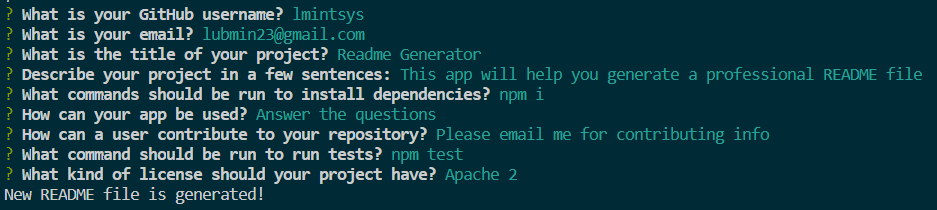
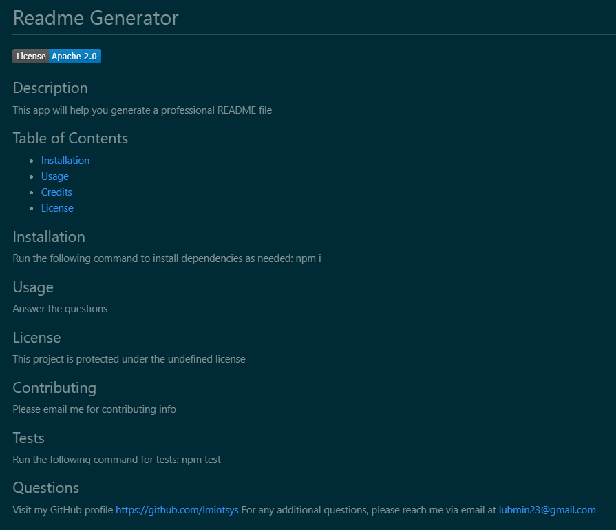

# Node.js README Generator

## Description

The aim of this project was to create a professional README file generator. The user is to answer a few questions about different sections of the README file the ywish to create, and a new README file is generated based on these answers.This application will allow users to generate a professional README file for their project. Working on this project helped me gaininng further understanding of how to create an interactive app outside the browser that communicates with the user, collects data, and writes it onto a separate file.

## Installation

To create this generator, the 8.2.4 version of the Inquirer NPM was installed.

## Usage

A user will be prompted with a series of questions. For most fields, the user may enter any input and it will be included in the correspondent section af a new README file. To choose the license, the user will be prompted with a multiple choice question where they will be able to choose any one from three different licenses or to choose "none". The badge of the chosen license will appear at the top of the README file and it will also include a link to the license.

[Walkthrough Video](https://watch.screencastify.com/v/eN9mcgJK9HKjVvtQFCLg)

## Credits

Luba Mintsys. https://github.com/lmintsys

## License

MIT License

Copyright (c) 2023 lmintsys

Permission is hereby granted, free of charge, to any person obtaining a copy
of this software and associated documentation files (the "Software"), to deal
in the Software without restriction, including without limitation the rights
to use, copy, modify, merge, publish, distribute, sublicense, and/or sell
copies of the Software, and to permit persons to whom the Software is
furnished to do so, subject to the following conditions:

The above copyright notice and this permission notice shall be included in all
copies or substantial portions of the Software.

THE SOFTWARE IS PROVIDED "AS IS", WITHOUT WARRANTY OF ANY KIND, EXPRESS OR
IMPLIED, INCLUDING BUT NOT LIMITED TO THE WARRANTIES OF MERCHANTABILITY,
FITNESS FOR A PARTICULAR PURPOSE AND NONINFRINGEMENT. IN NO EVENT SHALL THE
AUTHORS OR COPYRIGHT HOLDERS BE LIABLE FOR ANY CLAIM, DAMAGES OR OTHER
LIABILITY, WHETHER IN AN ACTION OF CONTRACT, TORT OR OTHERWISE, ARISING FROM,
OUT OF OR IN CONNECTION WITH THE SOFTWARE OR THE USE OR OTHER DEALINGS IN THE
SOFTWARE.
